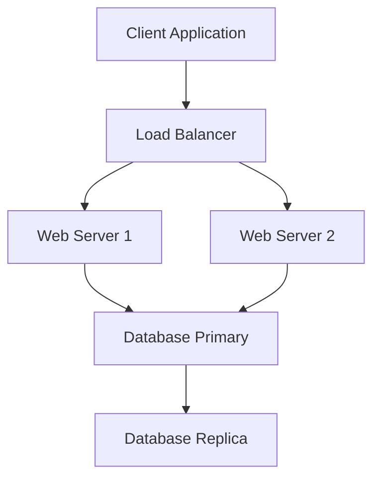

# Mermaid to Visio Converter

A Python tool that converts Mermaid diagrams into Microsoft Visio documents with automatic connection points and intelligent layout algorithms.

## Features

- **Parse Mermaid Syntax**: Converts Mermaid flowchart/graph diagrams into Visio shapes
- **Automatic Connection Points**: Adds configurable connection points to all shapes for easy wiring
- **Master Shape System**: Creates master shapes with thick borders; all other shapes auto-size to match
- **Two Layout Algorithms**:
  - **Flow Layout**: Hierarchical placement based on diagram structure
  - **Hilbert Curve**: Space-filling algorithm for even distribution
- **A4 Page Format**: Pre-configured for A4 dimensions
- **Command-line Interface**: Easy to use with file or clipboard input

## Prerequisites

- Windows (required for Visio COM automation)
- Microsoft Visio installed
- Python 3.7+

## Installation

1. Clone the repository:
```bash
git clone https://github.com/yourusername/mermaid-to-visio.git
cd mermaid-to-visio
```

2. Install dependencies:
```bash
pip install -r requirements.txt
```

## Usage

### Basic Usage

**From a file:**
```bash
python mermaid_to_visio.py --file diagram.mmd
```

**From clipboard:**
```bash
python mermaid_to_visio.py --clipboard
```

### Advanced Options

**Custom layout algorithm:**
```bash
python mermaid_to_visio.py --file diagram.txt --layout hilbert
```

**Custom connection points:**
```bash
python mermaid_to_visio.py --clipboard --horizontal 7 --vertical 5
```

**All options:**
```bash
python mermaid_to_visio.py -f diagram.mmd -l flow --horizontal 10 --vertical 4
```

### Command-line Arguments
```
Options:
  -h, --help              Show help message
  -f, --file FILE         Path to file containing Mermaid diagram
  -c, --clipboard         Read Mermaid diagram from clipboard
  -l, --layout {flow|hilbert}
                          Layout algorithm (default: flow)
  --horizontal N          Horizontal connection points (default: 5)
  --vertical N            Vertical connection points (default: 3)
```

## Mermaid Syntax Support

Currently supports basic Mermaid flowchart syntax:


### Supported Patterns

- Node definitions: `A[Label Text]`
- Connections: `A --> B` or `A[Label] --> B[Label]`
- Standalone nodes: `A[Label]`

## How It Works

1. **Parse**: Extracts nodes and edges from Mermaid syntax
2. **Layout**: Calculates optimal positions using chosen algorithm
3. **Master Shape**: Creates a master shape with thick border in top-left corner
4. **Generate Shapes**: Creates all diagram shapes linked to master
5. **Connection Points**: Automatically adds connection points to each shape
6. **Ready to Connect**: Open in Visio and manually wire connections

## Layout Algorithms

### Flow Layout (Default)
- Analyzes diagram hierarchy using breadth-first search
- Places nodes in levels based on connections
- Best for: Sequential processes, hierarchical structures

### Hilbert Curve
- Uses space-filling curves for even distribution
- Places nodes along a continuous path
- Best for: Dense diagrams, when hierarchy is unclear

## Connection Points

The tool automatically adds connection points to all four sides of each shape:

- **Horizontal points**: Top and bottom edges (default: 5)
- **Vertical points**: Left and right edges (default: 3)

These points are evenly distributed and make it easy to connect shapes in Visio.

## Master Shapes

A master shape is created in the top-left corner with:
- Thicker border (3pt vs default) for easy identification
- Label: "MASTER-Rectangle"
- All other shapes are linked via GUARD formulas

**To resize all shapes:** Simply resize the master shape in Visio, and all linked shapes update automatically.

## Examples

### Example 1: Simple Web Architecture
```bash
# Create file: web_arch.mmd
graph TD
    A[Client] --> B[Load Balancer]
    B --> C[Web Server 1]
    B --> D[Web Server 2]
    C --> E[Database]
    D --> E

# Generate diagram
python mermaid_to_visio.py --file web_arch.mmd
```

### Example 2: From Clipboard with Custom Points
1. Copy your Mermaid diagram to clipboard
2. Run:
```bash
python mermaid_to_visio.py --clipboard --horizontal 7 --vertical 5
```

## Troubleshooting

### "File not found" error
- Check the file path is correct
- Use absolute path if relative path fails

### "Clipboard is empty" error
- Make sure you've copied the Mermaid diagram first
- Try `--file` option instead

### "No valid Mermaid nodes found"
- Verify your Mermaid syntax
- Ensure nodes are defined like: `A[Label Text]`
- Check connections use `-->` syntax

### Visio doesn't open
- Ensure Microsoft Visio is installed
- Check Visio isn't already running with unsaved changes
- Try running Python as administrator

### pyperclip errors on Linux
- Install: `sudo apt-get install xclip` (or xsel)
- This tool is primarily designed for Windows

## Project Structure
```
mermaid-to-visio/
├── mermaid_to_visio.py    # Main script
├── requirements.txt        # Python dependencies
├── README.md              # This file
├── LICENSE                # MIT License
├── .gitignore            # Git ignore rules
└── examples/             # Example Mermaid diagrams
    ├── simple.mmd
    ├── web_architecture.mmd
    └── complex_flow.mmd
```

## Contributing

Contributions are welcome! Please feel free to submit a Pull Request.

### Ideas for Contributions
- Support for more Mermaid node types (diamonds, circles, etc.)
- Different arrow/connection styles
- Export to different page sizes
- Automatic connection drawing (challenging!)
- Support for Mermaid subgraphs
- Color coding based on node properties

## License

MIT License - see LICENSE file for details

## Author

Ric - OT Cybersecurity Professional

## Acknowledgments

- Inspired by the need to quickly convert architecture diagrams to Visio
- Connection point VBA code adapted from personal Visio automation scripts
- Hilbert curve implementation for creative layout options

## Roadmap

- [ ] Support for different shape types (diamond for decisions, etc.)
- [ ] Color coding support
- [ ] Multiple page support for large diagrams
- [ ] Auto-connection drawing (experimental)
- [ ] Support for Mermaid sequence diagrams
- [ ] Export to different Visio templates
- [ ] GUI interface (maybe)

## Version History

### v1.0.0 (2025-02-04)
- Initial release
- Flow and Hilbert layout algorithms
- Automatic connection points
- Master shape system
- Command-line interface with file and clipboard support
---

### From file
python mermaid_to_visio.py --file diagram.mmd

### From clipboard
python mermaid_to_visio.py --clipboard

### With custom layout
python mermaid_to_visio.py --file diagram.txt --layout hilbert

### With custom connection points
python mermaid_to_visio.py --clipboard --horizontal 7 --vertical 5

### Full customization
python mermaid_to_visio.py -f diagram.mmd -l flow --horizontal 10 --vertical 4

### Help
python mermaid_to_visio.py --help